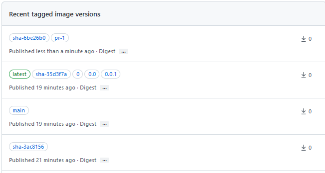

`ghcr-public-gha-test`
======

This repo contains test code to build and publish a container image on:

- all pushes to `main`
- all tags beginning with a `v` (which are assumed to be semver tags)

It generates a bunch of image tags for:

- `pr-x` for a PR number. This should be really nice if container builds are expensive -- people can pull the images built from the PR instead of rebuilding locally, if needed
- semvers at different levels. You get a tag for `major`, `major.minor`, and `major.minor.patch`.
- the current SHA
- `latest`
- the branch name

So after a few pushes, a PR, and a tag, your [packages page](https://github.com/jisantuc/ghcr-public-gha-test/pkgs/container/ghcr-public-gha-test) will look about like this:

To run this action, you'll just need to
[create a personal access token with the appropriate permissions](https://docs.github.com/en/packages/working-with-a-github-packages-registry/working-with-the-container-registry#authenticating-to-the-container-registry)
and [create a repo secret called `GHCR_PAT`](https://docs.github.com/en/actions/security-guides/encrypted-secrets).
